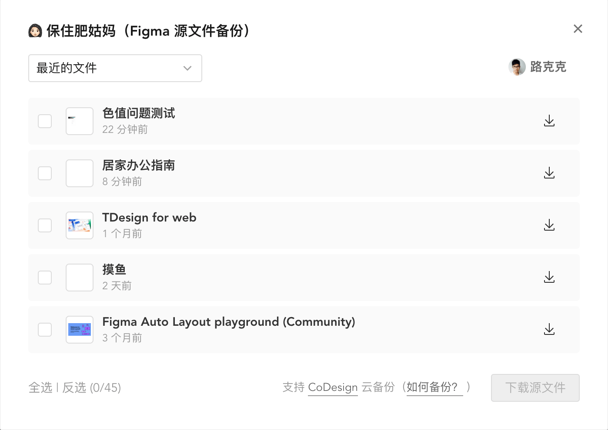

# 保住肥姑妈（Figma 源文件备份）

[查看官网](https://luke.gd/figma-backup)

## 功能介绍

- 🏢 支持切换多个账号和企业空间
- 📜 支持备份最近/草稿箱/团队的源文件
- 📦 支持按需下载 .fig 源文件
- ☁️ 支持 [CoDesign](https://codesign.woa.com/) 源文件云备份

## 如何使用

### 安装插件

第一步：安装 [Tampermonkey 插件](https://chrome.google.com/webstore/detail/tampermonkey/dhdgffkkebhmkfjojejmpbldmpobfkfo)

第二部：安装 [保住肥姑妈（Figma 源文件备份）](https://luke.gd/figma-backup/figma.user.js) 脚本

*如果你在国内无法正常访问上面的链接，可以使用以下备用链接*

- Tampermonkey 插件：[Firefox](https://addons.mozilla.org/zh-CN/firefox/addon/tampermonkey/) [Edge](https://microsoftedge.microsoft.com/addons/detail/tampermonkey/iikmkjmpaadaobahmlepeloendndfphd) | [CRX 下载](https://www.gugeapps.net/webstore/detail/tampermonkey/dhdgffkkebhmkfjojejmpbldmpobfkfo)
- 保住肥姑妈脚本：[Greasyfork](https://greasyfork.org/zh-CN/scripts/441666) [jsDelivr](https://cdn.jsdelivr.net/gh/loo2k/figma-backup/figma.user.js)

### 视频演示

https://user-images.githubusercontent.com/469964/158935141-1dff7be2-6d3b-458a-b59b-ee0f98c0c542.mp4

## 常见问题

- 批量下载时可能会遇到提示是否允许下载多个文件，点击允许即可
